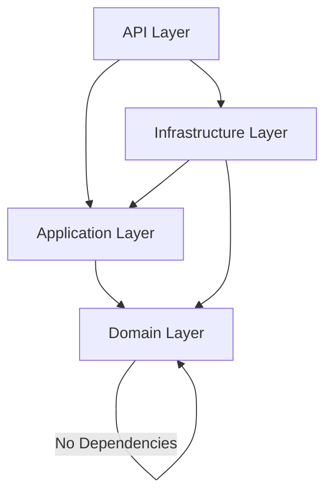

# SkillSwapAPI Architecture

This document describes the architecture of the SkillSwapAPI backend, a peer-to-peer skill exchange platform built with .NET 9 and Clean Architecture.

## Solution Structure

```
SkillSwapAPI/
├── src/
│   ├── SkillSwapAPI.Domain/          # Core business logic, entities, value objects
│   ├── SkillSwapAPI.Application/     # Use cases, CQRS, behaviors, interfaces
│   ├── SkillSwapAPI.Infrastructure/  # Data access, identity, external services
│   └── SkillSwapAPI.API/             # REST API, controllers, middleware
│
├── tests/
│   ├── SkillSwapAPI.Domain.UnitTests/
│   ├── SkillSwapAPI.Application.UnitTests/
│   └── SkillSwapAPI.API.IntegrationTests/
│
├── docs/
│   └── ARCHITECTURE.md
│
├── SkillSwapAPI.sln
├── global.json
└── README.md
```

## Dependency Rules



| Project | May Reference |
|---|---|
| **Domain** | None |
| **Application** | Domain |
| **Infrastructure** | Application, Domain |
| **API** | Application, Infrastructure |

> [!IMPORTANT]
> Domain and Application must **never** depend on Infrastructure or API.
> Application must not directly access DbContext or EF Core implementations — it uses abstractions only.

## Layer Responsibilities

### Domain Layer (`SkillSwapAPI.Domain`)

The innermost layer containing core business logic with zero external dependencies.

**Common Primitives:**
- `Entity<TId>` — Base entity with domain event support
- `AggregateRoot<TId>` — Aggregate root base class
- `AuditableEntity<TId>` — Entity with audit fields (CreatedOnUtc, ModifiedOnUtc, etc.)
- `ValueObject` — Value object base with structural equality
- `IDomainEvent` / `DomainEvent` — Domain event abstractions

**Result Pattern:**
- `Result` / `Result<T>` — Strongly typed operation results
- `Error` — Error representation with code, description, and type
- `ErrorType` — Enum: Failure, Validation, NotFound, Conflict, Unauthorized, Forbidden, Unexpected
- `ValidationResult` / `ValidationResult<T>` — Multi-error validation results

**Abstractions:**
- `IRepository<TEntity, TId>` — Generic repository interface
- `IUnitOfWork` — Unit of work interface

**Module Structure:**
```
Modules/
└── Identity/
    ├── Abstractions/     # IIdentityService, IAuthenticationService
    ├── Events/           # UserRegisteredEvent
    └── Enums/            # UserRole
```

### Application Layer (`SkillSwapAPI.Application`)

Orchestrates use cases using CQRS pattern with MediatR.

**CQRS Messaging:**
- `ICommand` / `ICommand<T>` — Command markers returning `Result`
- `ICommandHandler<T>` / `ICommandHandler<T, TResponse>` — Command handlers
- `IQuery<T>` — Query marker returning `Result<T>`
- `IQueryHandler<TQuery, TResponse>` — Query handlers
- `DomainEventNotification<T>` — Wraps domain events as MediatR notifications

**Pipeline Behaviors:**
- `ValidationBehavior` — Runs FluentValidation validators before handler execution
- `LoggingBehavior` — Logs request entry/exit with timing
- `PerformanceBehavior` — Warns on requests exceeding 500ms
- `UnhandledExceptionBehavior` — Catches and logs unhandled exceptions

**Common Interfaces:**
- `ICurrentUserService` — Current authenticated user abstraction
- `IUnitOfWork` / `IBaseRepository<T>` — Unit of Work and generic repository abstractions
- Dedicated repositories (`ISwapRequestRepository`, `IUserSkillRepository`, `ISkillRepository`, `ISkillCategoryRepository`, `IRefreshTokenRepository`, `IConversationRepository`, `IMessageRepository`) — Purpose-built query methods extending `IBaseRepository<T>`; handlers call one repo method instead of writing queries inline
- `IJwtProvider` — JWT token generation/validation
- `IEmailService` — Email sending abstraction
- `ICacheService` — Distributed cache abstraction
- `IDateTimeProvider` — Testable DateTime.UtcNow

**Models:**
- `PagedRequest` — Base for paginated queries
- `PagedResult<T>` — Paginated response model

### Infrastructure Layer (`SkillSwapAPI.Infrastructure`)

Implements all external concerns and abstractions defined in Application/Domain.

**Persistence:**
- `ApplicationDbContext` — EF Core DbContext inheriting IdentityDbContext with audit support
- `GenericRepository<TEntity, TId>` — Generic repository implementation
- `UnitOfWork` — Unit of work implementation

**Identity:**
- `ApplicationUser` — ASP.NET Core Identity user with extended properties
- `RefreshToken` — Refresh token entity with expiry and revocation tracking

**Authentication:**
- `JwtOptions` — JWT configuration (bound from appsettings)
- `JwtProvider` — JWT token generation with refresh token rotation

**Services:**
- `CurrentUserService` — Reads claims from HttpContext
- `DateTimeProvider` — Production DateTime provider
- `CacheService` — Distributed cache implementation (Redis or in-memory)

### API Layer (`SkillSwapAPI.API`)

HTTP entry point with controllers, middleware, and DI orchestration.

**Controllers:**
- `ApiBaseController` — Base controller with MediatR integration
- `HealthController` — Health check endpoint

**Hubs:**
- `ChatHub` — SignalR hub at `/hubs/chat` for real-time messaging; JWT-authenticated (token accepted from the `access_token` query string for WebSocket connections), authorizes swap membership and status (Accepted/Completed) per conversation, and broadcasts persisted messages to conversation groups

**Middleware:**
- `GlobalExceptionMiddleware` — Catches unhandled exceptions, returns ProblemDetails

**Contracts:**
- `ApiResponse` — Standard API response envelope
- `ApiError` — Error detail record

**Extensions:**
- `ResultExtensions` — Maps `Result`/`Result<T>` to HTTP responses with proper status codes

**Configuration:**
- JWT Bearer authentication
- Swagger with JWT security definition
- IP-based rate limiting (AspNetCoreRateLimit)
- CORS policy
- Health checks

## Adding a New Module

### Step 1: Domain

Create a new module folder:
```
Domain/Modules/YourModule/
├── Entities/
├── Aggregates/
├── ValueObjects/
├── Events/
├── Enums/
└── Abstractions/
```

### Step 2: Application

Create feature folders:
```
Application/Features/YourModule/
└── YourFeature/
    ├── Commands/
    │   ├── CreateSomething/
    │   │   ├── CreateSomethingCommand.cs      (implements ICommand<T>)
    │   │   ├── CreateSomethingCommandHandler.cs (implements ICommandHandler<T, TResponse>)
    │   │   └── CreateSomethingValidator.cs
    │   └── ...
    ├── Queries/
    │   ├── GetSomething/
    │   │   ├── GetSomethingQuery.cs            (implements IQuery<T>)
    │   │   ├── GetSomethingQueryHandler.cs     (implements IQueryHandler<T, TResponse>)
    │   │   └── SomethingResponse.cs
    │   └── ...
    └── DTOs/
```

### Step 3: Infrastructure

Add entity configurations in `Persistence/Configurations/` and module-specific repositories if needed.

### Step 4: API

Create a controller:
```csharp
[ApiController]
[Route("api/[controller]")]
public class YourModuleController : ApiBaseController
{
    [HttpPost]
    public async Task<IActionResult> Create(CreateSomethingCommand command)
    {
        var result = await Mediator.Send(command);
        return result.ToCreatedResult();
    }
}
```

## Technology Stack

| Technology | Purpose |
|---|---|
| .NET 9 | Runtime and framework |
| Entity Framework Core 9 | ORM and database access |
| SQL Server | Primary database |
| ASP.NET Core Identity | User management |
| JWT Bearer | Authentication |
| MediatR | CQRS and mediator pattern |
| FluentValidation | Input validation |
| Redis (optional) | Distributed caching |
| AspNetCoreRateLimit | API rate limiting |
| Swagger/OpenAPI | API documentation |
| xUnit + FluentAssertions | Testing |

## Configuration

All configuration is managed through `appsettings.json`:

- **ConnectionStrings:DefaultConnection** — SQL Server connection string
- **ConnectionStrings:Redis** — Redis connection (optional, falls back to in-memory)
- **Jwt** — JWT signing key, issuer, audience, and token lifetimes
- **IpRateLimiting** — Rate limiting rules

> [!CAUTION]
> Never commit real secrets or connection strings. Use User Secrets or environment variables for local development and Azure Key Vault / secure config for production.

## Building and Testing

```bash
# Restore dependencies
dotnet restore

# Build the solution
dotnet build

# Run all tests
dotnet test

# Run the API
dotnet run --project src/SkillSwapAPI.API
```
